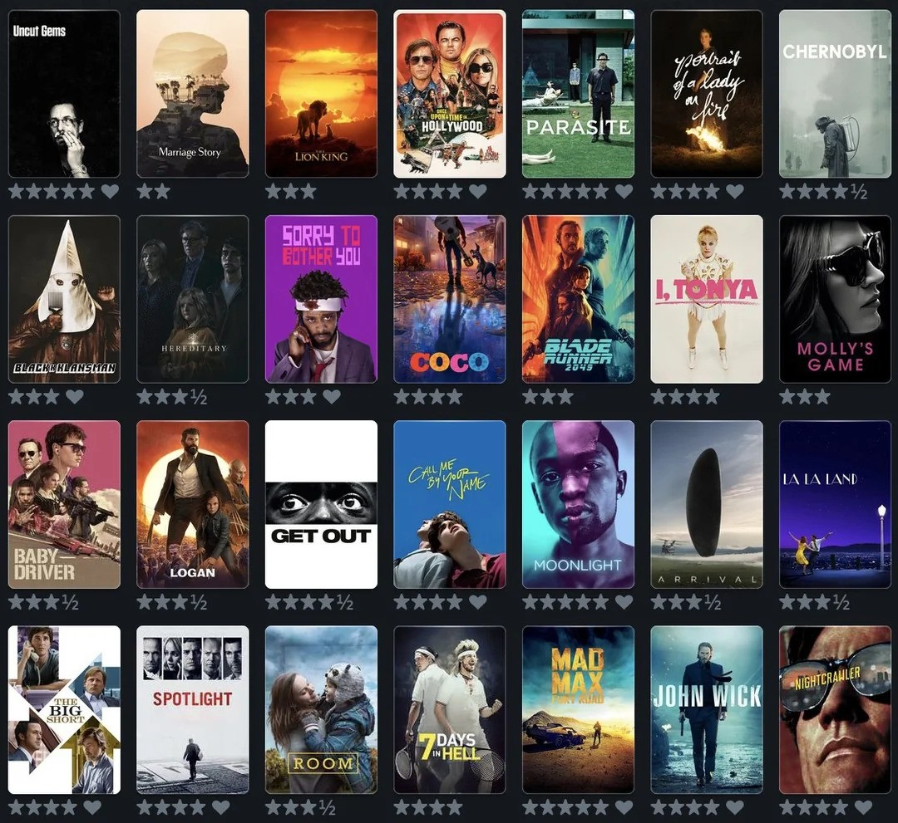
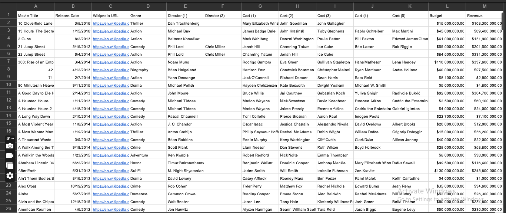
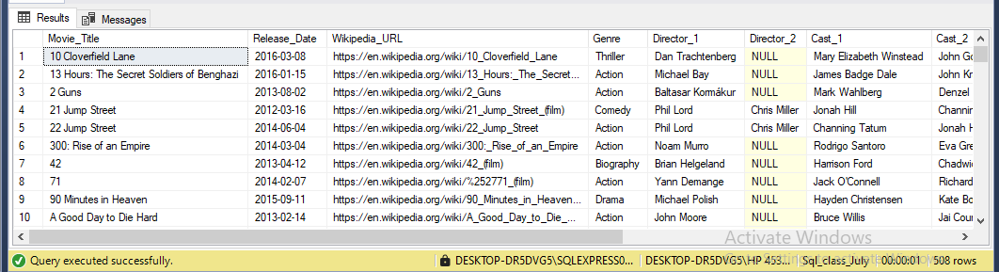
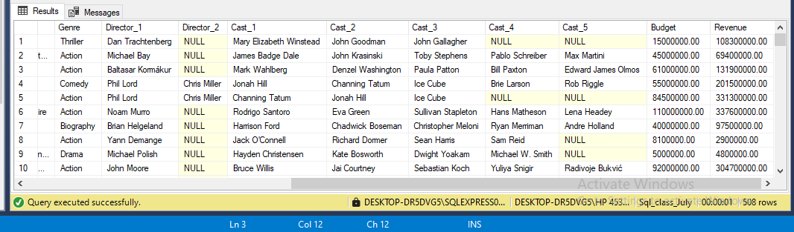

# **Movie Data Analysis Project**



## **Introduction**  
The movie industry thrives on data-driven decisions. This project explores a movie dataset sourced from Kaggle to understand patterns in movie performance and identify factors that influence success. This dataset consists of one table and 12 columns. SQL queries were extensively used to manipulate and analyze the data, showcasing practical expertise in database querying.  

Through this analysis, we address key questions about movie genres, revenue trends, and the impact of release dates and directors. The aim is to provide actionable insights that stakeholders in the movie industry can use to make informed decisions.
Here is the link to dataset: (https://drive.google.com/file/d/187gpdvovkd3XcEYEY18SbNWw2hh7p5YR/view?usp=sharing)

---

## **What I am trying to solve?**  



The movie industry is competitive and dynamic, and producers face challenges in understanding:  
1. The most popular and profitable genres.  
2. The effect of release timing on movie success.  
3. How single or multiple directors influence a movie's performance.  

This project leverages SQL queries to extract and analyze the dataset, providing answers to these challenges.

---

## **Skills Demonstrated**  
1. **SQL Querying:** Used various SQL techniques, including SELECT, WHERE, DISTINCT, GROUP BY, and aggregate functions like COUNT, SUM, AVG, MIN, and MAX.  
2. **Data Transformation:** Applied logical operators and filters to clean and prepare the dataset for analysis.  
3. **Data Analysis:** Used SQL to uncover insights about genres, revenue, directors, and release dates.  
4. **Business Insight Development:** Translated technical outputs into actionable insights for decision-making.

---

## **Data Sourcing**  
The dataset used in this analysis was sourced from Kaggle and contains:  
- Movie titles  
- Genres  
- Release dates  
- Revenue and budget details  
- Director information  

It is a dummy dataset designed for learning and demonstration purposes.

---

## **Data Transformation**  
To prepare the dataset for analysis, the following SQL queries were used:  
1. **Viewing All Data:**  
   ```sql
   SELECT * FROM Movie_data;
   ```




2. **Checking for Distinct Genres:**  
   ```sql
   SELECT DISTINCT
   Genre AS Distinct_genre
   FROM Movie_data;
   ```
3. **Filtering Movies by Genre:**  
   - Action Movies:  
     ```sql
     SELECT Movie_title, Genre FROM Movie_data WHERE Genre = 'Action';
     ```
   - Comedy Movies:  
     ```sql
     SELECT Movie_title, Genre FROM Movie_data WHERE Genre = 'Comedy';
     ```

4. **Excluding Genres:**  
   - Movies Excluding Horror:  
     ```sql
     SELECT Movie_title, Genre FROM Movie_data WHERE Genre != 'Horror';
     ```

5. **Filtering by Revenue:**  
   - Movies with Revenue < $5,000,000:  
     ```sql
     SELECT movie_title, Revenue FROM Movie_data WHERE Revenue < 5000000;
     ```
   - Movies with Revenue > $100,000,000:  
     ```sql
     SELECT movie_title, Revenue FROM Movie_data WHERE Revenue > 100000000;
     ```

6. **Filtering by Release Date and Genre:**  
   - Action Movies Released on June 4, 2014:  
     ```sql
     SELECT Movie_title, Genre, Release_date FROM Movie_data 
     WHERE Genre = 'Action' AND Release_date = '2014-06-04';
     ```

---

## **Modeling**  
The SQL queries were further used to group and summarize data for deeper insights.  

1. **Revenue by Genre:**  
   ```sql
   SELECT Genre, SUM(Revenue) AS Total_revenue_generated 
   FROM Movie_data 
   GROUP BY Genre 
   ORDER BY Total_revenue_generated DESC;
   ```

2. **Director Analysis:**  
   - Movies with a Single Director:  
     ```sql
     SELECT Movie_title, Director_1, Director_2 
     FROM Movie_data 
     WHERE Director_2 IS NULL;
     ```

   - Movies with Multiple Directors:  
     ```sql
     SELECT Movie_title, Director_1, Director_2 
     FROM Movie_data 
     WHERE Director_2 IS NOT NULL;
     ```

3. **Top Performers in Q2 2015:**  
   ```sql
   SELECT TOP (1) Movie_title, Release_date, Revenue 
   FROM Movie_data 
   WHERE Release_date BETWEEN '2015-04-01' AND '2015-06-30' 
   ORDER BY Revenue DESC;
   ```

4. **Movies with the Lowest Revenue:**  
   ```sql
   SELECT TOP (1) Movie_title, Revenue 
   FROM Movie_data 
   ORDER BY Revenue ASC;
   ```

---

## **Analysis**  
From the analysis, the following insights were obtained:  
1. **Genres:**  
   Action and drama movies were the most frequent and profitable genres.  
2. **Revenue Trends:**  
   - Movies generating over $100 million dominated the dataset.  
   - The second quarter of 2015 proved to be a high-revenue period.  
3. **Director Contributions:**  
   - Movies with single directors were more common, but those with multiple directors showed significant contributions.  
4. **Release Timing:**  
   - Movies released between April and June performed exceptionally well.

---

## **Conclusion and Recommendations**  
### **Conclusion**  
This project highlights the power of SQL in analyzing and interpreting movie data. Action and drama genres emerged as the most popular and profitable, while the second quarter of the year was identified as a strategic period for releasing movies. Directors also play a significant role, with both single and multiple-director movies contributing to the industry.  

### **Recommendations**  
1. **Focus on High-Performing Genres:** Studios should prioritize action and drama movies.  
2. **Strategic Release Dates:** Plan movie releases between April and June to maximize revenue potential.  
3. **Invest in Strong Directorial Teams:** Leverage the expertise of seasoned directors or director duos.  

This project demonstrates proficiency in SQL and provides a framework for further analysis and decision-making in the movie industry. The SQL code included in this documentation highlights the technical skills applied in achieving the findings.  

--- 

This structured report with integrated code ensures your recruiter can see your SQL expertise while understanding the real-world implications of the analysis.
